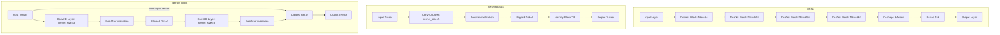

# TEEP2023_Mutimodal_Biometric_Authentication
# dataset: 
train file: train-clean-100 + train-clean-360 + train-clean-500

test file: test-other, test-clean, dev-clean, dev-other

```mermaid
graph TD
    subgraph CNNs
        A2[Input Layer] --> B2[ResNet Block: filter=64]
        B2 --> C2[ResNet Block: filter=128]
        C2 --> D2[ResNet Block: filter=256]
        D2 --> G2[ResNet Block: filter=512]
    
        G2 --> N2[Reshape & Mean]
        N2 --> P2[Dense 512]
        P2 --> Q2[Output Layer]
    end

    subgraph ResNet block
        A3[Input Tensor] --> B3[Conv2D Layer: kernel_size=5]
        B3 --> C3[BatchNormalization]
        C3 --> D3[Clipped ReLU]
        D3 --> E3[Identity Block * 3]
        E3 --> F3[Output Tensor]
    end

    subgraph Identity Block
        A[Input Tensor] --> B[Conv2D Layer: kernel_size=3]
        A --> |Add Input Tensor| H
        B --> C[BatchNormalization]
        C --> D[Clipped ReLU]
        D --> E[Conv2D Layer: kernel_size=3]
        E --> F[BatchNormalization]

        F --> H[Clipped ReLU]
        H --> I[Output Tensor]
    end
```
