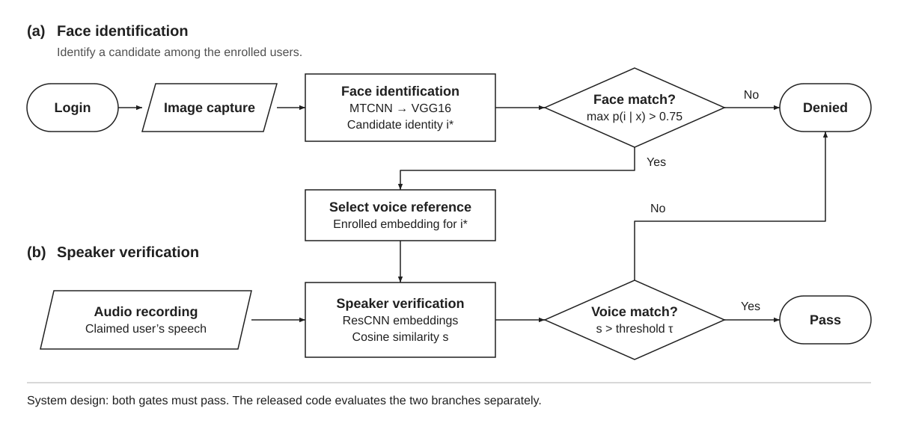
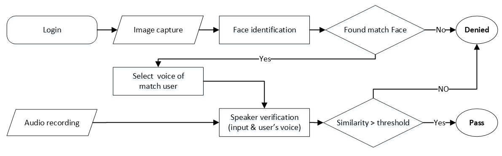
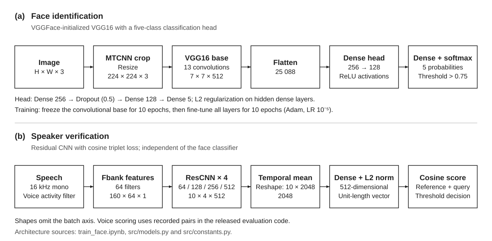
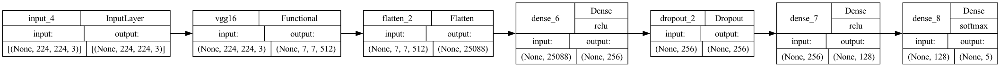
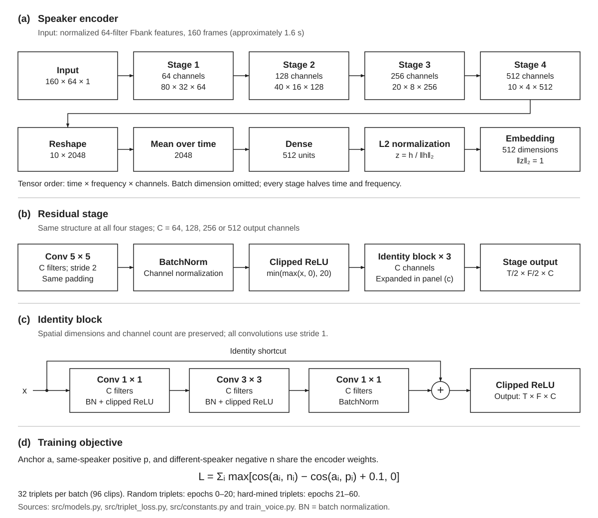

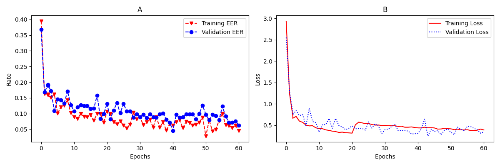

<!-- Animated Header -->


<div align="center">

[](https://digital-library.theiet.org/doi/abs/10.1049/icp.2024.4141) &nbsp;
[](https://arxiv.org/abs/2601.06218) &nbsp;

</div>

<p align="center">
<strong>Identify with the face, verify with the voice.</strong><br/>
A research design that first <em>identifies</em> a user with a fine-tuned <strong>VGG16</strong> face classifier (MTCNN-cropped),
then <em>verifies</em> them with a <strong>ResNet speaker encoder</strong> trained with triplet loss. The design uses an ordinary webcam and microphone.
</p>

<!-- Quick Links -->
<div align="center">
  <a href="#key-features"></a>
  <a href="#architecture"></a>
  <a href="#getting-started"></a>
  <a href="#results"></a>
</div>

<br/>

---

## How It Works

Authentication is a **two-gate pipeline**. Step 1 answers *who is this?* Step 2 answers *can they prove it?*
Both gates must pass in the proposed system.

**Implementation status:** this repository runs the two branches separately. `test_face.py` captures one webcam frame; `test_voice.py` evaluates recorded LibriSpeech audio. Live microphone capture, voiceprint enrollment, and the combined authentication controller are not implemented.

<div align="center"></div>

*Figure 1. Authentication workflow redrawn from the original system diagram. The matched face identity selects the reference used for voice verification; failure at either gate denies access.*

<details>
<summary>Original flow diagram (PNG)</summary>
<div align="center"></div>
</details>

---

## Key Features

| Component | Face branch | Voice branch |
|---|---|---|
| **Model** | 👤 VGG16 conv base (VGGFace weights) + custom FC head, softmax over enrolled users | 🔊 Deep-Speaker style **ResCNN**, 4 residual stages → 512-d L2-normalised embedding |
| **Pre-processing** | MTCNN detection, bounding-box padding, resize to 224×224, Albumentations augmentation (flip, brightness/contrast, gamma, blur, noise) | FLAC→WAV, energy-based **VAD**, 64-filter **Fbank**, per-frame normalisation, 160-frame clips |
| **Training** | 🔄 Two stages: FC head with frozen base → unfreeze all and fine-tune at LR 1e-5 | 🔄 Two stages: random triplets (epochs 0–20) → **hard-triplet mining** (epochs 21–60) with cosine triplet loss |
| **Decision** | ⚡ Accept `argmax` only when softmax probability > 0.75 | ⚡ Design: compare input with enrolled embedding; code: score recorded pairs across thresholds |
| **Evaluation** | 📊 Accuracy, precision, recall, confusion matrix | 📊 Accuracy, precision, recall and F-measure at the best-F1 threshold; **EER** at FAR ≈ FRR |

---

## Architecture

### Pipeline at a glance

The model summaries trace inputs through the face classifier and speaker encoder. Tensor dimensions omit the batch axis and follow `train_face.ipynb`, `src/models.py` and `src/constants.py`. All diagrams use a fixed white background for consistent viewing and print export.

<div align="center"></div>

*Figure 2. Model overview: (a) VGG16 face identification; (b) ResCNN speaker verification. The two branches are trained independently.*

### Face recognition model

Fine-tuned **VGG16** with the top removed. Weights are loaded from a VGGFace checkpoint (`vgg_face_weights.h5`, not included), then a small classification head is trained in two stages.

| Stage | Trainable layers | Optimiser | Epochs | Batch |
|---|---|---|---|---|
| A · head only | Dense 256 → Dropout 0.5 → Dense 128 → Softmax | Adam (default LR) | 10 | 20 |
| B · full fine-tune | All VGG16 conv blocks + head | Adam, LR 1e-5 | 10 | 20 |

<details>
<summary>Keras layer graph (PNG)</summary>
<div align="center"></div>
</details>

### Voice recognition model

Residual CNN speaker encoder trained with **cosine triplet loss** (margin α = 0.1). Input is a 160 × 64 filter-bank map (≈1.6 s of speech); output is a 512-d unit-length embedding.

<div align="center"></div>

*Figure 3. Speaker encoder architecture: (a) full forward pass; (b) residual stage; (c) identity block with additive shortcut; (d) cosine triplet-loss training. All four stages use a stride-2 convolution followed by three identity blocks. C denotes the channel count; T and F denote time and frequency dimensions.*

[Open full-size voice architecture](doc/voice_architecture.svg). The SVGs contain editable text and remain white in light and dark viewers. Regenerate them with `python3 doc/generate_figures.py` (requires `pycairo`).

<details>
<summary>Voice model Mermaid source</summary>


</details>

| Hyper-parameter | Value | Where |
|---|---|---|
| Triplets per batch | 32 (→ 96 clips) | `src/constants.py` `BATCH_SIZE` |
| Triplet margin α | 0.1 | `ALPHA` |
| Frames per clip | 160 | `NUM_FRAMES` |
| Epochs (random / mined) | 0–20 random, 21–60 mined | `train_voice.py` |
| Hard-mining candidate pool | 640 clips × 10-batch history | `CANDIDATES_PER_BATCH`, `HIST_TABLE_SIZE` |
| Negatives per test anchor | 99 | `TEST_NEGATIVE_No` |

---

## Dataset

| Modality | Source | Details |
|---|---|---|
| **Face** | Custom, collected from EE class students | 5 subjects, 462 MTCNN-cropped frames → 924 after augmentation, 80/20 split. Cropped images in `Dataset/output_dataset/`; labels in `Dataset/output_dataset.csv`. |
| **Voice** | [LibriSpeech](https://www.openslr.org/12) | `train-clean-360` for training, `test-clean` (40 speakers) for evaluation. Speaker ID is parsed from the `<speaker>-<chapter>-<utt>` filename. |

---

## Getting Started

### Requirements

Use Python 3.10 and a **TensorFlow 2 / Keras 2** environment. The code uses legacy imports such as `keras.layers.convolutional`; an unpinned install of current Keras is unsuitable. There is no dependency lockfile. The following is an inferred starting environment, not an end-to-end validated setup:

```bash
python3.10 -m venv .venv
source .venv/bin/activate
python -m pip install --upgrade pip
python -m pip install "tensorflow==2.12.*" "keras==2.12.*" "numpy<1.24" \
    "opencv-python<4.9" "opencv-python-headless<4.9" "albumentations<1.4" \
    pandas scikit-learn "scipy<1.14" matplotlib seaborn librosa \
    python_speech_features pydub jupyter "setuptools<81"
```

The legacy layer paths are present in [Keras 2.12](https://github.com/keras-team/keras/blob/v2.12.0/keras/layers/__init__.py). Platform-specific TensorFlow installation may be needed on Apple Silicon. Install **ffmpeg** for FLAC conversion; notebook layer-graph export also needs **Graphviz** and `pydot`.

### Required assets

| Asset | Used by | Availability |
|---|---|---|
| Cropped face images and label index | `train_face.ipynb` | Included in `Dataset/output_dataset/` and `Dataset/output_dataset.csv` |
| `mtcnn/data/mtcnn_weights.npy` | `image_preprocessing.py`, `test_face.py` | Missing; supply weights compatible with the vendored MTCNN implementation before face detection |
| `vgg_face_weights.h5` | `train_face.ipynb` | External VGGFace weights, loaded into the VGG16 base with `by_name=True` |
| `face_model_vggface.h5` | `test_face.py` | Save the trained notebook model explicitly; see the face pipeline below |
| LibriSpeech `train-clean-360`, `test-clean` | Voice preprocessing and evaluation | Download separately from [OpenSLR](https://www.openslr.org/12) |
| `checkpoints_sample/model_60_64440_0.55928.h5` | `test_voice.py` | Included; copy into the configured checkpoint folder to evaluate without training |

MTCNN source is vendored under `mtcnn/` (MIT, Iván de Paz Centeno). Installing another `mtcnn` package does not supply the missing file to this local package automatically.

### Configure paths first

Run commands from the repository root after updating these paths:

| File | Required configuration |
|---|---|
| `image_preprocessing.py` | Change `pd.read_csv("dataset.csv")` to `Dataset/dataset.csv`; set raw-image and crop-output folders. Raw images are needed only to regenerate crops. |
| `dataset_mine.py` | Point `parent_directory` at the crop folder and write its index to `Dataset/output_dataset.csv`, matching the notebook. |
| `train_face.ipynb` | Replace absolute paths for VGGFace weights, the CSV, crop folder and metric exports. The classifier has five outputs; adapt it for a different number of subjects. |
| `src/constants.py` | Align `WAV_DIR`, `DATASET_DIR` and `TEST_DIR` with your audio/features folders. `WAV_DIR` currently names `train-clean-100`, while `DATASET_DIR` names `train-clean-360-npy`. |
| `voice_preprocessing.py` | Edit the explicit paths in the `__main__` block too: they currently process only `audio/test-clean/LibriSpeech/test-clean/`, overriding the defaults in `src/constants.py`. |
| `test_face.py` | Set the webcam index in `cv2.VideoCapture(1)` for your device and place the saved face model at the path passed to `load_model`. |

The voice feature output folders must exist and their `out_dir` arguments must end with `/`: `prep()` constructs filenames by concatenating strings. Prepare both training and test features before training.

### Project structure

```
.
├── image_preprocessing.py   # MTCNN face detection, crop, resize to 224×224
├── dataset_mine.py          # Builds output_dataset.csv (image_id, label) from cropped folders
├── train_face.ipynb         # VGG16 two-stage fine-tuning, curves, confusion matrix
├── test_face.py             # Webcam capture → crop → predict → threshold 0.75
├── voice_preprocessing.py   # FLAC→WAV, VAD, Fbank → .npy (multiprocessing)
├── train_voice.py           # Random-batch pre-training → hard-triplet mining, per-epoch eval
├── test_voice.py            # Speaker-verification evaluation (acc, EER, P/R/F)
├── src/
│   ├── models.py            # ResCNN speaker encoder
│   ├── triplet_loss.py      # Cosine triplet loss (deep_speaker_loss)
│   ├── random_batch.py      # Threaded random triplet generator
│   ├── select_batch.py      # Threaded hard-triplet miner with history table
│   ├── silence_detector.py  # SPL-based VAD
│   ├── constants.py         # All paths and hyper-parameters
│   └── utils.py             # Checkpoint helpers, curve plotting
├── eval/eval_metrics.py     # Threshold sweep: accuracy, precision, recall, F1, EER
├── mtcnn/                   # Vendored MTCNN (MIT)
├── Dataset/                 # Cropped face images and CSV indexes
├── doc/                     # Diagrams and result figures
└── checkpoints_sample/      # Sample voice checkpoint + per-epoch train/val logs
```

### Face pipeline

The included crops let you start with the notebook. To regenerate crops from your own raw images, configure the paths above and run:

```bash
python image_preprocessing.py
python dataset_mine.py
```

Open the notebook, run the training stages, then save the trained `model`:

```bash
jupyter notebook train_face.ipynb
```

```python
# Run in the notebook after fine-tuning; model_v2 has a newly initialized head.
model.save("face_model_vggface.h5")
```

The plotting cells use `final_val_acc` and `final_val_loss` before they are assigned. Run their metric-assembly cells before plotting, or skip the plotting/export cells when training. Preserve the notebook's label mapping to interpret the predicted class index.

```bash
python test_face.py
```

**Face test prerequisite:** importing `face_crop` also reads the dataset CSV and runs the cropping job in `image_preprocessing.py`. Its paths and detector weights must be configured even when testing only a webcam frame. The test prints a class index when its softmax probability exceeds 0.75.

### Voice pipeline

With the default feature paths in `src/constants.py`, create the output and checkpoint folders:

```bash
mkdir -p audio/LibriSpeech/train-clean-360-npy audio/LibriSpeech/test-clean-npy
mkdir -p checkpoints/best_checkpoint
```

Set the two calls in the `voice_preprocessing.py` main block to process training audio, then run the script:

```python
cvt_process_and_save("audio/LibriSpeech/train-clean-360/",
                     "audio/LibriSpeech/train-clean-360/")
preprocess_and_save("audio/LibriSpeech/train-clean-360/",
                    "audio/LibriSpeech/train-clean-360-npy/")
```

```bash
python voice_preprocessing.py
```

Repeat with `test-clean` and `test-clean-npy` in those calls. Ensure the resulting `.npy` folders match `DATASET_DIR` and `TEST_DIR`.

Choose either training or the included checkpoint:

```bash
# Train on prepared features (resumes if checkpoints/ already contains weights).
python train_voice.py
```

```bash
# Alternatively, use the included voice checkpoint without training.
cp -n checkpoints_sample/model_60_64440_0.55928.h5 checkpoints/
```

Then evaluate:

```bash
python test_voice.py
```

Evaluation runs ten randomized trials on `TEST_DIR`. It selects the latest checkpoint by filename; confirm the printed path is the model you intend to evaluate. Without a checkpoint, it evaluates randomly initialized weights.

Training writes `checkpoints/train_acc_eer_loss.txt` and `checkpoints/val_acc_eer_loss.txt`, saves recent and improving-EER checkpoints, and plots the logs on completion.

> **Evaluation output caveat:** the final print statement in `test_voice.py` mislabels F-measure as precision and precision as recall. For those metrics, use the values returned by `eval_model`: `(fm, tpr, acc, eer, precision)`.

---

## Results

<div align="center">

| System | Accuracy | Equal Error Rate | Precision | Recall |
|---|---|---|---|---|
| **Face identification** (5 subjects) | **95.135%** | – | 96.317% | 95.153% |
| **Speaker verification** (LibriSpeech test-clean) | **99.1%** | 3.456% | 86.48% | 88.65% |

</div>

These values are retained from the original project README. They are reported branch-level results, not a measured success rate for the combined authentication design. The [arXiv abstract](https://arxiv.org/abs/2601.06218) instead lists 95.1% face accuracy and 98.9% voice accuracy, and names `train-other-360`; the code's training feature path names `train-clean-360`.

The notebook records **98.38%** face accuracy, while the sample checkpoint's final validation log records **98.97%** voice accuracy and **6.30% EER**. These artifacts do not reproduce every value in the table. The face notebook augments images before its 80/20 split, so original and augmented versions can occur on opposite sides of the split.

Standalone voice evaluation samples 1 positive and 99 negatives per anchor; accuracy is therefore dominated by true rejections. Read precision, recall and EER alongside accuracy.

<div align="center">



*Face recognition, training vs. validation: (A) accuracy, (B) loss. Epochs 0–9 train the head only; 10–19 fine-tune the whole network.*



*Speaker verification, training vs. validation: (A) EER, (B) triplet loss. Hard-triplet mining starts at epoch 21.*

<details>
<summary>Face confusion matrix (validation split)</summary>

</details>

</div>

---

## Citation

Publication metadata follows the [arXiv journal reference](https://arxiv.org/abs/2601.06218): volume 2024, issue 22, published in 2025.

```bibtex
@article{chen2025twostep,
  title     = {Two-step Authentication: Multi-biometric System Using Voice and Facial Recognition},
  author    = {Chen, Kuan Wei and Lin, Ting Yi and Yang, Wen Ren and Kesarwani, Aryan and Singh, Riya},
  journal   = {IET Conference Proceedings},
  volume    = {2024},
  number    = {22},
  pages     = {11--12},
  year      = {2025},
  publisher = {IET},
  doi       = {10.1049/icp.2024.4141}
}
```

---

## Acknowledgement

This research is supported by **TEEP** (Taiwan Experience Education Program) at **National Changhua University of Education**.

The voice branch builds on the Deep Speaker approach (ResCNN + triplet loss) and its open-source Keras implementations. Face detection uses the MIT-licensed MTCNN package by Iván de Paz Centeno.

---

<!-- Animated Footer -->

